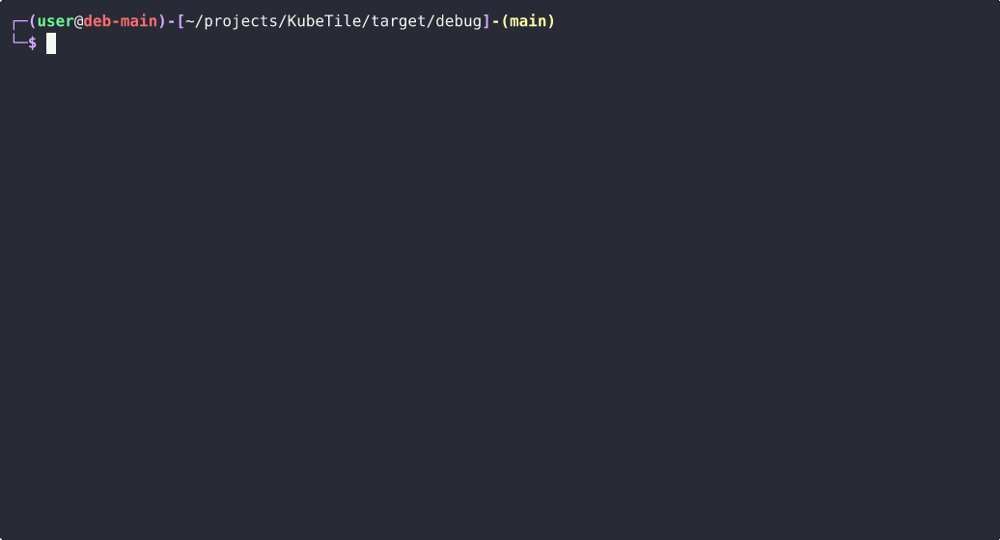

# KubeTile

> A keyboard-driven Kubernetes TUI for developers who live in the terminal.



KubeTile started as a personal tool to handle my daily Kubernetes workflow without leaving the terminal — browsing resources, streaming logs, exec-ing into pods, and debugging running containers, written in **Rust**.

---

## Features

**Navigation & Layout**
- Split panes (vertical / horizontal), tabs, fullscreen — all keyboard-driven
- Live resource lists for all standard K8s kinds: Pods, Deployments, Services, StatefulSets, DaemonSets, Jobs, CronJobs, ConfigMaps, Secrets, Ingresses, Nodes, Namespaces, PVs, PVCs
- Filter, sort columns, toggle all-namespaces, YAML view, describe view

**Cluster Interaction**
- Stream pod logs with follow, filter, wrap, save, and full export
- Interactive exec sessions inside containers
- Port-forwarding with a prompt UI and active-forwards panel
- Namespace and context switching overlays

**Debug Workflows**
- **Debug mode** (`Ctrl+Alt+d` on a Pod) — patches the owner Deployment to `sleep infinity` so you can exec in without the application interfering; restores the original command on exit
- **Root debug mode** (`F5` on a Pod) — same as above with `securityContext.runAsUser: 0` for root access; original securityContext restored on exit

**Developer Experience**
- Status bar with current cluster, namespace, and input mode
- Toast notifications, confirmation dialogs, context-sensitive help overlay
- Resource switcher command palette (`:`)
- Works gracefully without a cluster connection

---

## Quick Start

**Requirements:** Rust ≥ 1.75, `kubectl` in `PATH`, a valid `~/.kube/config`.

```bash
# Install from source
git clone https://github.com/gitavk/KubeTile
cd KubeTile
cargo install --path crates/kubetile-app
```

Or download a pre-built binary from the [Releases](https://github.com/gitavk/KubeTile/releases) page (Linux x86_64/aarch64, `.deb`, `.rpm`).

```bash
kubetile
```

KubeTile connects to your current kubeconfig context on launch. Press `F1` for the keybinding reference at any time.

---

## Documentation

Full documentation is available in the [KubeTile Book](https://gitavk.github.io/KubeTile):

- [Installation](https://gitavk.github.io/KubeTile/installation.html)
- [Keybindings](https://gitavk.github.io/KubeTile/keybindings.html)
- [Views & Workflows](https://gitavk.github.io/KubeTile/views.html)
- [Configuration](https://gitavk.github.io/KubeTile/configuration.html)
- [Demo Stand](https://gitavk.github.io/KubeTile/demo-stand.html)

---

## Built With

| Crate | Role |
|-------|------|
| [ratatui](https://github.com/ratatui-org/ratatui) + [crossterm](https://github.com/crossterm-rs/crossterm) | Terminal UI rendering |
| [kube-rs](https://github.com/kube-rs/kube) | Kubernetes API client |
| [tokio](https://tokio.rs) | Async runtime |

---

## License

MIT — see [`LICENSE`](LICENSE).
